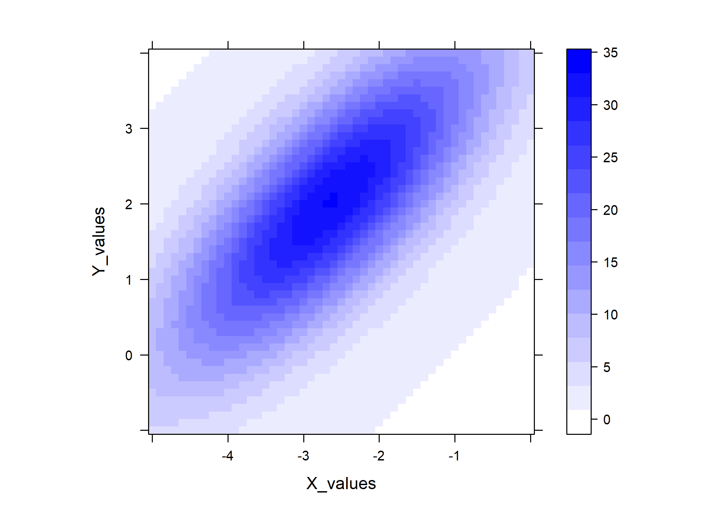
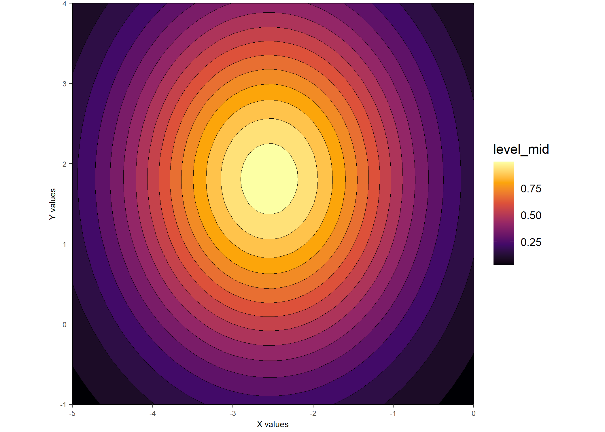

<!-- README.md is generated from README.Rmd. Please edit that file -->

# gaussplotR 

<!-- badges: start -->

[](https://www.repostatus.org/#active)
[](https://github.com/vbaliga/gaussplotR/actions)
[](https://codecov.io/gh/vbaliga/gaussplotR?branch=master)
[](https://doi.org/10.5281/zenodo.4041073)
[](https://CRAN.R-project.org/package=gaussplotR)
<!-- badges: end -->

`gaussplotR` provides functions to fit two-dimensional Gaussian
functions, predict values from such functions, and produce plots of
predicted data.

## Installation

You can install `gaussplotR` from CRAN via:

``` r
install.packages("gaussplotR")
```

Or to get the latest (developmental) version through github, use:

``` r
devtools::install_github("vbaliga/gaussplotR")
```

## Example

The function `fit_gaussian_2D()` is the workhorse of `gaussplotR`. It
uses `stats::nls()` to find the best-fitting parameters of a 2D Gaussian
fit to supplied data based on one of three formula choices. The function
`autofit_gaussian_2D()` can be used to automatically figure out the best
formula choice and arrive at the best-fitting parameters.

The `predict_gaussian_2D()` function can then be used to predict values
from the Gaussian over a supplied grid of X- and Y-values (generated
here via `expand.grid()`). This is useful if the original data is
relatively sparse and interpolation of values is desired.

Plotting can then be achieved via `ggplot_gaussian_2D()`, but note that
the `data.frame` created by `predict_gaussian_2D()` can be supplied to
other plotting frameworks such as `lattice::levelplot()`. A 3D plot can
also be produced via `rgl_gaussian_2D()` (not shown here).

``` r
library(gaussplotR)

## Load the sample data set
data(gaussplot_sample_data)

## The raw data we'd like to use are in columns 1:3
samp_dat <-
  gaussplot_sample_data[,1:3]


#### Example 1: Unconstrained elliptical ####
## This fits an unconstrained elliptical by default
gauss_fit_ue <-
  fit_gaussian_2D(samp_dat)

## Generate a grid of X- and Y- values on which to predict
grid <-
  expand.grid(X_values = seq(from = -5, to = 0, by = 0.1),
              Y_values = seq(from = -1, to = 4, by = 0.1))

## Predict the values using predict_gaussian_2D
gauss_data_ue <-
  predict_gaussian_2D(
    fit_object = gauss_fit_ue,
    X_values = grid$X_values,
    Y_values = grid$Y_values,
  )

## Plot via ggplot2 and metR
library(ggplot2); library(metR)
ggplot_gaussian_2D(gauss_data_ue)
```


``` r

## And another example plot via lattice::levelplot()
library(lattice)
lattice::levelplot(
  predicted_values ~ X_values * Y_values,
  data = gauss_data_ue,
  col.regions = colorRampPalette(
    c("white", "blue")
    )(100),
  asp = 1
)
```



``` r

#### Example 2: Constrained elliptical_log ####
## This fits a constrained elliptical, as in Priebe et al. 2003
gauss_fit_cel <-
  fit_gaussian_2D(
    samp_dat,
    method = "elliptical_log",
    constrain_orientation = -1
  )

## Generate a grid of x- and y- values on which to predict
grid <-
  expand.grid(X_values = seq(from = -5, to = 0, by = 0.1),
              Y_values = seq(from = -1, to = 4, by = 0.1))

## Predict the values using predict_gaussian_2D
gauss_data_cel <-
  predict_gaussian_2D(
    fit_object = gauss_fit_cel,
    X_values = grid$X_values,
    Y_values = grid$Y_values,
  )

## Plot via ggplot2 and metR
ggplot_gaussian_2D(gauss_data_cel)
```



Should you be interested in having `gaussplotR` try to automatically
determine the best choice of `method` for `fit_gaussian_2D()`, the
`autofit_gaussian_2D()` function can come in handy. The default is to
select the `method` that produces a fit with the lowest `rmse`, but
other choices include `rss` and `AIC`.

``` r
## Use autofit_gaussian_2D() to automatically decide the best 
## model to use
gauss_auto <-
  autofit_gaussian_2D(
    samp_dat,
    comparison_method = "rmse", 
    simplify = TRUE
    )

## The output has the same components as `fit_gaussian_2D()` 
## but for the automatically-selected best-fitting method only:
gauss_auto
#> $coefs
#>         A_o      Amp    theta    X_peak   Y_peak         a         b
#> 1 0.8272942 32.25132 3.581234 -2.638124 2.021262 0.9072492 0.9611345
#> 
#> $model
#> Nonlinear regression model
#>   model: response ~ A_o + Amp * exp(-((((X_values - X_peak) * cos(theta) -     (Y_values - Y_peak) * sin(theta))/a)^2 + (((X_values - X_peak) *     sin(theta) - (Y_values - Y_peak) * cos(theta))/b)^2)/2)
#>    data: data
#>     A_o     Amp   theta  X_peak  Y_peak       a       b 
#>  0.8273 32.2513  3.5812 -2.6381  2.0213  0.9072  0.9611 
#>  residual sum-of-squares: 156.2
#> 
#> Number of iterations to convergence: 13 
#> Achieved convergence tolerance: 3.931e-06
#> 
#> $model_error_stats
#>        rss     rmse deviance      AIC
#> 1 156.2272 2.083181 156.2272 171.0041
#> 
#> $fit_method
#>          method       amplitude     orientation 
#>    "elliptical" "unconstrained" "unconstrained" 
#> 
#> attr(,"gaussplotR")
#> [1] "gaussplotR_fit"
```

## Citation

Baliga, VB. 2020. gaussplotR: Fit, predict, and plot 2D gaussians in R.
R package version 0.2.3. <https://cran.r-project.org/package=gaussplotR>

## License

GPL (\>= 3) + file LICENSE

🐢
